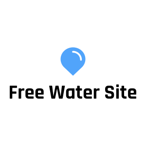

# Free Water Map

## Overview

Free Water Map is an interactive web application designed to help users find free drinking water locations using OpenStreetMap and Google Street View. The project is hosted on Google Cloud Platform (GCP) using the Free Tier, with a custom domain `freewatersite.org`.

## Features

- Interactive map with markers for drinking water locations
- Search functionality with autocomplete
- Street View previews for each location
- Responsive design
- Custom domain setup

## Technologies Used

- **Frontend**: HTML, CSS, JavaScript, Leaflet.js
- **Backend**: Google Cloud Storage, Google Cloud DNS
- **APIs**: OpenStreetMap API, Google Street View API
